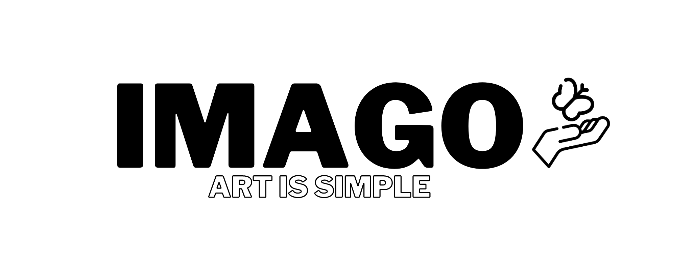

# Imago - растровый графический редактор.

Программа, предназначенная для создания, обработки и сохранения растровых изображений.

## Функционал

- #### Карандаш

- #### Ластик

- #### Набор кистей
  - Базовая кисть
  - Неоновая кисть
  - Мягкая кисть
  - Скетч кисть
  - Орнаментальная кисть
  - Меховая Кисть

- #### Набор фигурных кистей
  - Прямоугольник
  - Круг

- #### Набор фигур
  - Прямая линия
  - Треугольник
  - Прямоугольный треугольник
  - Прямоугольник
  - Круг
  - Эллипс

- #### Фильтры
  - Негатив
  - Сепия
  - Черно-белый
  - Контраст
  - Радужные линии
  - Серые тона
  - Бинаризация
  - Вертикальное отражение
  - Горизонтальное отражение
  - Удаление шума
  - Объем
  - Увеличение насыщенности цветов
  - Размытие
  - Резкость
  > Кнопки undo/redo и сбросить в окне позволяют управлять историей применения фильтров

- #### Настройка рисующего инструмента.
  > Выбор цвета и размера.

- #### Настройка холста
  > Выбор высоты, ширины, а также ширины и цвета рамки.

- #### Система горячих клавиш и подсказки к ним

- #### Редактирование и вставка текста
  > Выбор стиля, цвета и размера, поворот на заданный градус.

- #### Редактирование и вставка фото
  > Поддерживается система drag and drop, изменение размер фото через фиксированные углы.

- #### Штамп
  > Позволяет копировать и проявлять элементы

- #### Пипетка
  > Отображает цвет, на который наведен курсор, по клику устанавливает как текущий

- #### Заливка
  > Возможность настроить затрагиваемые цвета по мере их схожести (от 0 до 100 %)

- #### Выделение области
  > Позволяет рисовать только в выделенной области
  - Копирование и вставка области
  - Очистка выделенной области

- #### Рука
  > Позволяет передвигать и центрировать холст

- #### Кнопки управлением историей правок.
  > Undo/Redo

- #### Слои
  - Добавить слой сверху/снизу
  - Добавить/удалить слой
  - Поднять/опустить слой
  - Скрыть/показать слой
  - Заблокировать/разблокировать слой для рисующих инструментов

- #### Скачать рисунок в формате .png

- #### Очистить текущий слой.

## Разработчики

* Тимур Ионов (капитан) - [@sir-timio](https://github.com/sir-timio)
* Валерия Захарова - [@Zyxkim](https://github.com/Zyxkim)
* Павел Дьячек - [@Perpure](https://github.com/Perpure)
* Алина Торопчина - [@alina-torr](https://github.com/alina-torr)
* Даниэла Обущарова - [@DanielaObushcharova](https://github.com/DanielaObushcharova)
* Юлия Беликова - [@julia-bel](https://github.com/julia-bel)
* Милана Тюрнина - [@tyurnina](https://github.com/tyurnina)
